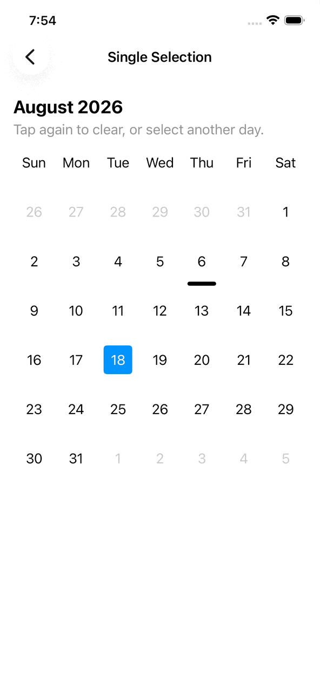
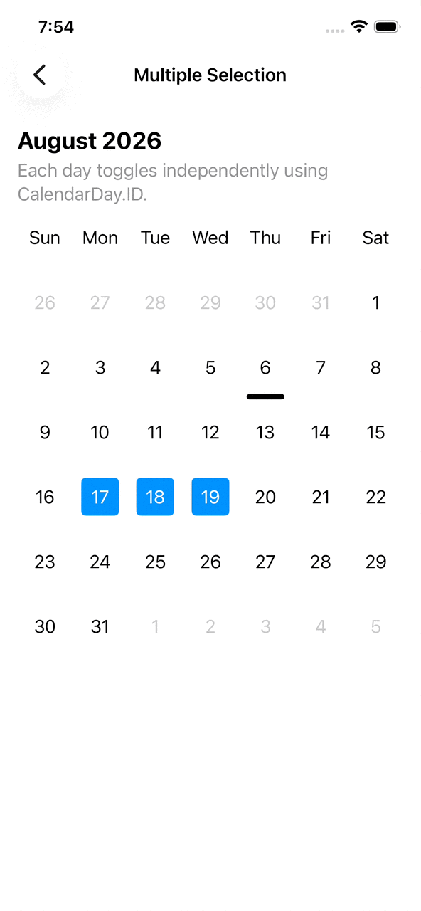
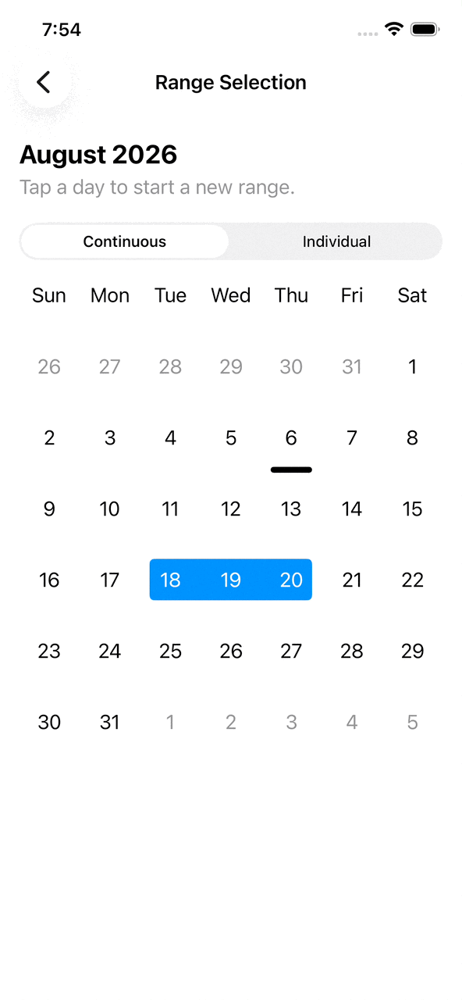

<p align="center">
  <picture>
    <source
      media="(prefers-color-scheme: dark)"
      srcset="Sources/CalendarKit/CalendarKit.docc/Resources/calendar-kit-card~dark.png"
    >
    
  </picture>
</p>

# CalendarKit

[](https://www.swift.org)
[](#requirements)
[](#installation)
[](https://nicholasmata.github.io/CalendarKit/documentation/)
[](https://github.com/NicholasMata/CalendarKit/actions/workflows/deploy-docc.yml)

CalendarKit is a layered Swift package for building calendar experiences on
Apple platforms. It separates calendar-aware date modeling from SwiftUI layout
so you can use the Foundation utilities on their own or compose a custom
calendar interface from reusable views.

CalendarKit currently provides:

- Calendar-aware day, week, and month values
- Period navigation and month-grid calculations that respect the configured
  calendar
- Localized weekday labels ordered by `Calendar.firstWeekday`
- A generic seven-column SwiftUI month grid
- Default selectable day cells and month-grid layout helpers
- A modifier for collapsing a month grid toward a selected week

Browse the [complete documentation](https://nicholasmata.github.io/CalendarKit/documentation/)
for API references and guides covering all three package modules.

## Examples

Explore the [SwiftUI example app](Example/README.md) to see CalendarKit's
components and common interactions in context.

<table>
  <thead>
    <tr>
      <th>Single Selection</th>
      <th>Multiple Selection</th>
      <th>Range Selection</th>
    </tr>
  </thead>
  <tbody>
    <tr>
      <td>
        <picture>
          <source
            media="(prefers-color-scheme: dark)"
            srcset="docs/media/single-selection-dark.gif"
          >
          
        </picture>
      </td>
      <td>
        <picture>
          <source
            media="(prefers-color-scheme: dark)"
            srcset="docs/media/multiple-selection-dark.gif"
          >
          
        </picture>
      </td>
      <td>
        <picture>
          <source
            media="(prefers-color-scheme: dark)"
            srcset="docs/media/range-selection-dark.gif"
          >
          
        </picture>
      </td>
    </tr>
  </tbody>
</table>

## Requirements

- Swift 6.0 or later
- iOS 16 or later
- macOS 13 or later

## Installation

In Xcode:

1. Open your app project.
2. Choose **File → Add Package Dependencies**.
3. Enter the repository URL:

   ```text
   https://github.com/NicholasMata/CalendarKit.git
   ```

4. Set the dependency rule to **Exact Version** and enter `0.1.0-alpha.1`.
   This is an alpha release, so APIs may change before the first stable release.
5. Add `CalendarKit` and `CalendarExtensions` to your app target.

Import `CalendarKit` for the SwiftUI components and `CalendarExtensions` for
calendar period values and utilities. `CalendarUI` currently has no public
views, so most apps do not need to add that product yet.

## Quick Start

Create a calendar month and provide the content for each visible day:

```swift
import CalendarExtensions
import CalendarKit
import SwiftUI

struct MonthExample: View {
  @State private var selectedDate: Date?

  private let calendar = Calendar.current

  var body: some View {
    let month = CalendarMonth(containing: .now, calendar: calendar)

    VStack(spacing: 16) {
      WeekdayLabels(using: calendar)

      DaysOfMonthGrid(month: month) { cell in
        DefaultDayView(
          cell: cell,
          selectedDate: selectedDate
        )
        .onTapGesture {
          selectedDate = cell.id
        }
        .allowsHitTesting(!cell.isOutsideMonth)
      }
    }
  }
}
```

`DaysOfMonthGrid` includes the leading and trailing dates needed to render
complete weeks. Those cells have `cell.isOutsideMonth == true`, allowing you to
hide, dim, or disable them according to your interface's selection rules.

## Package Structure

The package is organized into three layers:

- **CalendarExtensions** provides Foundation-only period models, calendar math,
  and date utilities. It has no SwiftUI dependency.
- **CalendarKit** provides composable SwiftUI building blocks such as
  `WeekdayLabels`, `DaysOfMonthGrid`, and `DefaultDayView`.
- **CalendarUI** is reserved for higher-level, opinionated calendar experiences
  built from CalendarKit. It does not currently expose a public view.

Use `CalendarExtensions` for calendar-domain logic or import both
`CalendarExtensions` and `CalendarKit` when building a custom interface.

## Contributing

Contributions are welcome. See [CONTRIBUTING.md](CONTRIBUTING.md) for local
development, testing, documentation, and commit-message guidelines.
